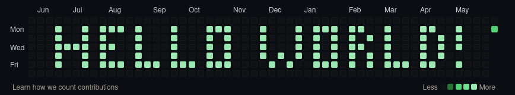

# Bruce

This repository is a simple experiment on the github contributions graph  
It's goal is to use the graph to display a simple 52*7 pixel image as a banner (hence the repository name)  
Feel free to have fun with it

## Usage

* Edit banner.png image with only black and white pixels
* Installer les dépendances avec `pip install -r requirements.txt`
* Launch banner.py
* Push the result on a public repo you own
* Check your github profile without beeing logged in

## Disclaimer

I am not responsible in any way of the repercussions it could have on your github account  
Use at your own risks
